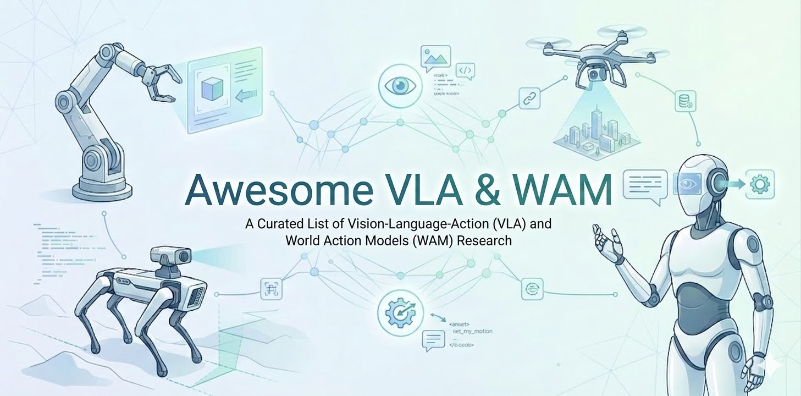

# 🤖 Awesome VLA & WAM

**📜 A Curated List of Vision-Language-Action (VLA) and World Action Models (WAM) Research and Beyond**  

  

*Photo Credit: [Gemini-Nano-Banana🍌](https://aistudio.google.com/models/gemini-3-pro-image)*.

## Overview
- 🎯 [Aim](#aim)
- 📚 [VLA Definition](#vla-definition) | [WAM Definition](#wam-definition)
- 🔍 [Survey](#survey)

**Vision-Language-Action (VLA) Models**
- 🧠 [General VLA](#general-vla)
- 🌐 [VLA with 3D/4D Modelling](#vla-with-3d4d-modelling)
- 🔥 [VLA with Reinforcement Learning](#vla-with-reinforcement-learning)
- 🪶 [Efficient VLA](#efficient-vla)
- 🧪 [VLA with Latent Actions](#vla-with-latent-actions)
- 🧭 [Domain-Specific VLA (e.g., Humanoid, Dexterous, Tactile)](#domain-specific-vla-eg-humanoid-dexterous-tactile)
- 🧷 [Other Topics in VLA](#other-topics-in-vla)

**World Action Models (WAM)**
- 🗺️ [General World Models](#general-world-models)
- 🎬 [World Action Models from VideoGen](#world-action-models-from-videogen)
- 🌍 [World Action Models from VLM](#world-action-models-from-vlm)
- ✨ [World Action Models from Scratch](#world-action-models-from-scratch)

**Other Policies**
- 🦾 [Traditional Policies](#traditional-policies)
- 🦾 [Code as Policy](#code-as-policy)

**Resources**
- 💾 [Robotics Datasets](#robotics-datasets)
- 👨🏻 [Ego Human Datasets](#ego-human-datasets)
- 📊 [Benchmark / Environment](#benchmark--environment)
- 🏞️ [Physics Engine](#physics-engine)
- 🖥️ [Hardware](#hardware)

## Aim
This is a curated list of VLA and WAM research, systematically organized to provide a comprehensive view of the recent advance in robotics foundation models. It will be continuously updated and refined, with the goal of clarifying the research context for scholars in the domain of robotics foundation models. If you have any new papers worth adding, please feel free to push or raise an issue. Join us in maintaining a high-quality VLA & WAM & More list.

## VLA Definition
In short, VLA models are a type of robotics policy that inherits the pretrained VLMs' rich language grounding and visual understanding abilities to offer a scalable route toward general-purpose, language-conditioned robot policies. We can trace the origin and formal definition of the VLA to the work RT-2.

- [⭐️] **RT-2**, RT-2: Vision-Language-Action Models Transfer Web Knowledge to Robotic Control.  

## WAM Definition
In short, WAM models are a type of robotics policy that leverages the world modeling capability (i.e., predicting future states) for action prediction. We refer to the great work DreamZero, which formally coins the name World Action Model, for details.

- [⭐️] **DreamZero**, World Action Models are Zero-shot Policies.  

There is an intersection between VLA and WAM: WAMs built upon pretrained VLMs. These models are simultaneously both VLA and WAM.

## Survey
- Vision-Language-Action (VLA) Models: Concepts, Progress, Applications and Challenges.  

- A Survey on Vision-Language-Action Models for Embodied AI.  

## General VLA

[VLA with World Modeling](#world-action-models-from-vlm)

- **Qwen-VLA**, Qwen-VLA: Unifying Vision-Language-Action Modeling across Tasks, Environments, and Robot Embodiments.  

- **Pion**, Rethinking Muon Beyond Pretraining: Spectral Failures and High-Pass Remedies for VLA and RLVR.  

- **MolmoAct2**, MolmoAct2 Action Reasoning Models for Real-World Deployment.  

- **RLDX-1**, RLDX-1 Technical Report.  

- **StarVLA-α**, StarVLA-α: Reducing Complexity in Vision-Language-Action Systems.  

- **StarVLA**, StarVLA: A Lego-like Codebase for Vision-Language-Action Model Developing.  

- **VLANeXt**, VLANeXt: Recipes for Building Strong VLA Models.  

- **LAP**, LAP: Language-Action Pre-Training Enables Zero-shot Cross-Embodiment Transfer.  

- **CoVer-VLA**, Scaling Verification Can Be More Effective than Scaling Policy Learning for Vision-Language-Action Alignment.  

- [⭐️] **Egoscale**, EgoScale: Scaling Dexterous Manipulation with Diverse Egocentric Human Data.  

- **HoloBrain-0**, HoloBrain-0 Technical Report.  

- **ABot-M0**, ABot-M0: VLA Foundation Model for Robotic Manipulation with Action Manifold Learning.  

- **SimVLA**, SimVLA: A Simple VLA Baseline for Robotic Manipulation.  

- **Lingbot-VLA**, A Pragmatic VLA Foundation Model.  

- **ACoT-VLA**, ACoT-VLA: Action Chain-of-Thought for Vision-Language-Action Models.  

- [⭐️] Emergence of Human to Robot Transfer in Vision-Language-Action Models.  

- **FASTer**, FASTer: Toward Efficient Autoregressive Vision Language Action Modeling via Neural Action Tokenization. 

- **GenieReasoner**, Unified Embodied VLM Reasoning with Robotic Action via Autoregressive Discretized Pre-training.  

- [⭐️] **π∗0.6**, π∗0.6: a VLA That Learns From Experience.  

- 10 Open Challenges Steering the Future of Vision-Language-Action Models. 

- **AVA-VLA**, AVA-VLA: Improving Vision-Language-Action models with Active Visual Attention. 

- **AsyncVLA**, AsyncVLA: Asynchronous Flow Matching for Vision-Language-Action Models.  

- **VLA-0**, VLA-0: Building State-of-the-Art VLAs with Zero Modification.  

- **X-VLA**, X-VLA: Soft-Prompted Transformer as Scalable Cross-Embodiment Vision-Language-Action Model.  

- **ATE**, Align-Then-stEer: Adapting the Vision-Language Action Models through Unified Latent Guidance.  

- **Discrete Diffusion VLA**, Discrete Diffusion VLA: Bringing Discrete Diffusion to Action Decoding in Vision-Language-Action Policies.  

- **MolmoAct**, MolmoAct: Action Reasoning Models that can Reason in Space.  

- **SmolVLA**, SmolVLA: A Vision-Language-Action Model for Affordable and Efficient Robotics.  

- **NORA**, NORA: A Small Open-Sourced Generalist Vision Language Action Model for Embodied Tasks.  

- **CronusVLA**, CronusVLA: Towards Efficient and Robust Manipulation via Multi-Frame Vision-Language-Action Modeling.  

- [⭐️] **π0.5**, π0.5: a Vision-Language-Action Model with Open-World Generalization.  

- [⭐️] **Gemini Robotics**, Gemini Robotics: Bringing AI into the Physical World.  

- [⭐️] **OpenVLA-OFT**, Fine-Tuning Vision-Language-Action Models: Optimizing Speed and Success.  

- **ChatVLA**, ChatVLA: Unified Multimodal Understanding and Robot Control with Vision-Language-Action Model.  

- [⭐️] **FAST**, FAST: Efficient Action Tokenization for Vision-Language-Action Models.  

- **CogACT**, CogACT: A Foundational Vision-Language-Action Model for Synergizing Cognition and Action in Robotic Manipulation.  

- **RoboVLMs**, Towards Generalist Robot Policies: What Matters in Building Vision-Language-Action Models.  

- [⭐️] **π0**, π0: A Vision-Language-Action Flow Model for General Robot Control.  

- [⭐️] **OpenVLA**, OpenVLA: An Open-Source Vision-Language-Action Model.  

- **RoboFlamingo**, Vision-Language Foundation Models as Effective Robot Imitators.  

- [⭐️] **RT-2**, RT-2: Vision-Language-Action Models Transfer Web Knowledge to Robotic Control.  

## VLA with 3D/4D Modelling

- **4D-VLA**, 4D-VLA: Spatiotemporal Vision-Language-Action Pretraining with Cross-Scene Calibration.  

- **3D CAVLA**, 3D CAVLA: Leveraging Depth and 3D Context to Generalize Vision Language Action Models for Unseen Tasks.  

- **SpatialVLA**, SpatialVLA: Exploring Spatial Representations for Visual-Language-Action Model.  

- [⭐️] **3D-VLA**, 3D-VLA: A 3D Vision-Language-Action Generative World Model.  

## VLA with Reinforcement Learning

- **EVOLVE-VLA**, EVOLVE-VLA: Test-Time Training from Environment Feedback for Vision-Language-Action Models. 

- **WMPO**, WMPO: World Model-based Policy Optimization for Vision-Language-Action Models. 

- **SRPO**, SRPO: Self-Referential Policy Optimization for Vision-Language-Action Models. 

- **RLinf**, RLinf: Flexible and Efficient Large-scale Reinforcement Learning via Macro-to-Micro Flow Transformation. 

- **World-Env**, World-Env: Leveraging World Model as a Virtual Environment for VLA Post-Training. 

- **SimpleVLA-RL**, SimpleVLA-RL: Scaling VLA Training via Reinforcement Learning. 

- **VLA-Reasoner**, VLA-Reasoner: Empowering Vision-Language-Action Models with Reasoning via Online Monte Carlo Tree Search. (Not RL strictly, it's planning) 

- **ThinkAct**, ThinkAct: Vision-Language-Action Reasoning via Reinforced Visual Latent Planning. 

- **TGRPO**, TGRPO: Fine-tuning Vision-Language-Action Model via Trajectory-wise Group Relative Policy Optimization. 

- **VLA-RL**, VLA-RL: Towards Masterful and General Robotic Manipulation with Scalable Reinforcement Learning. 

- **RIPT-VLA**, Interactive Post-Training for Vision-Language-Action Models. 

- **GRAPE**, GRAPE: Generalizing Robot Policy via Preference Alignment. 

## Efficient VLA

- **PokeVLA**, PokeVLA: Empowering Pocket-Sized Vision-Language-Action Model with Comprehensive World Knowledge Guidance.  

- **HBVLA**, HBVLA: Pushing 1-Bit Post-Training Quantization for Vision-Language-Action Models. 

- **MergeVLA**, MergeVLA: Cross-Skill Model Merging Toward a Generalist Vision-Language-Action Agent.  

- **VLA-Adapter**, VLA-Adapter: An Effective Paradigm for Tiny-Scale Vision-Language-Action Model.  

- **FLOWER**, FLOWER: Democratizing Generalist Robot Policies with Efficient Vision-Language-Action Flow Policies.  

- [⭐️] **TinyVLA**, TinyVLA: Towards Fast, Data-Efficient Vision-Language-Action Models for Robotic Manipulation.  

## VLA with Latent Actions

- **From Pixels to Tokens**, From Pixels to Tokens: A Systematic Study of Latent Action Supervision for Vision-Language-Action Models.  

- **Motus**, Motus: A Unified Latent Action World Model.  

- [⭐️] **GR00T N1**, GR00T N1: An Open Foundation Model for Generalist Humanoid Robots.  

- [⭐️] **LAPA**, Latent Action Pretraining from Videos.  

## Domain-Specific VLA (e.g., Humanoid, Dexterous, Tactile)

- **METIS**, METIS: Multi-Source Egocentric Training for Integrated Dexterous Vision-Language-Action Model. 

- **Tactile-VLA**, Tactile-VLA: Unlocking Vision-Language-Action Model's Physical Knowledge for Tactile Generalization. 

- **CombatVLA**, CombatVLA: An Efficient Vision-Language-Action Model for Combat Tasks in 3D Action Role-Playing Games.  

- **Humanoid-VLA**, Humanoid-VLA: Towards Universal Humanoid Control with Visual Integration. 

## Other Topics in VLA

- **DynamicVLA**, DynamicVLA: A Vision-Language-Action Model for Dynamic Object Manipulation.  

- **TwinVLA**, TwinVLA: Data-Efficient Bimanual Manipulation with Twin Single-Arm Vision-Language-Action Models.  

- **MemoryVLA**, MemoryVLA: Perceptual-Cognitive Memory in Vision-Language-Action Models for Robotic Manipulation.  

- **ReconVLA**, ReconVLA: Reconstructive Vision-Language-Action Model as Effective Robot Perceiver.  

- **X-ICM**, Exploring the Limits of Vision-Language-Action Manipulations in Cross-task Generalization.  

- **ForceVLA**, ForceVLA: Enhancing VLA Models with a Force-aware MoE for Contact-rich Manipulation.  

- **TraceVLA**, TraceVLA: Visual Trace Prompting Enhances Spatial-Temporal Awareness for Generalist Robotic Policies.  

## General World Models

- [⭐️] **DreamDojo**, DreamDojo: A Generalist Robot World Model from Large-Scale Human Videos.  

- Learning Latent Action World Models In The Wild. 

- **PointWorld**, PointWorld: Scaling 3D World Models for In-The-Wild Robotic Manipulation.  

- **NitroGen**, NitroGen: An Open Foundation Model for Generalist Gaming Agents.  

- **Puffin**, Thinking with Camera: A Unified Multimodal Model for Camera-Centric Understanding and Generation.  

- **CoLA-World**, Co-Evolving Latent Action World Models. 

- **Yume**, Yume: An Interactive World Generation Model.  

- **PlayerOne**, PlayerOne: Egocentric World Simulator.  

- **Matrix-Game**, Matrix-Game: Interactive World Foundation Model.  

- **WorldMem**, WorldMem: Long-term Consistent World Simulation with Memory.  

- **AdaWorld**, AdaWorld: Learning Adaptable World Models with Latent Actions.  

- [⭐️] **Cosmos**, Cosmos World Foundation Model Platform for Physical AI.  

- **GameFactory**, GameFactory: Creating New Games with Generative Interactive Videos.  

- **The Matrix**, The Matrix: Infinite-Horizon World Generation with Real-Time Moving Control.  

- [⭐️] **Genie**, Genie: Generative Interactive Environments.  

- **Playable Environments**, Playable Environments: Video Manipulation in Space and Time. 

- **CADDY**, Playable Video Generation. 

- **CLASP**, Learning what you can do before doing anything. 

- [⭐️] **ACVP**, Action-Conditional Video Prediction using Deep Networks in Atari Games. 

## World Action Models from VideoGen

- **DeFI**, Disentangled Robot Learning via Separate Forward and Inverse Dynamics Pretraining.  

- **GigaWorld-Policy**, GigaWorld-Policy: An Efficient Action-Centered World--Action Model.  

- **Fast-WAM**, Fast-WAM: Do World Action Models Need Test-time Future Imagination?.  

- Do World Action Models Generalize Better than VLAs? A Robustness Study. 

- [⭐️] **DreamZero**, World Action Models are Zero-shot Policies.  

- [⭐️] **Cosmos Policy**, Cosmos Policy: Fine-Tuning Video Models for Visuomotor Control and Planning.  

- [⭐️] **World-VLA-Loop**, World-VLA-Loop: Closed-Loop Learning of Video World Model and VLA Policy.  

- **Lingbot-VA**, Causal World Modeling for Robot Control.  

- **mimic-video**, mimic-video: Video-Action Models for Generalizable Robot Control Beyond VLAs.  

- **Video Policy**, Video Generators are Robot Policies.  

- **UniVLA**, UniVLA: Learning to Act Anywhere with Task-centric Latent Actions.  

- **DreamGen**, DreamGen: Unlocking Generalization in Robot Learning through Video World Models.  

- **Inverse Probabilistic Adaptation**, Solving New Tasks by Adapting Internet Video Knowledge.  

- **VPP**,Video Prediction Policy: A Generalist Robot Policy with Predictive Visual Representations.  

- **GR-2**, GR-2: A Generative Video-Language-Action Model with Web-Scale Knowledge for Robot Manipulation.  

- [⭐️] **GR-1**, Unleashing Large-Scale Video Generative Pre-training for Visual Robot Manipulation.  

- **VLP**, Video Language Planning.  

- **UniPi**, Learning Universal Policies via Text-Guided Video Generation.  

## World Action Models from VLM

- [⭐️] **π0.7**, π0.7: a Steerable Generalist Robotic Foundation Model with Emergent Capabilities.  

- **LDA-1B**, LDA-1B: Scaling Latent Dynamics Action Model via Universal Embodied Data Ingestion.  

- **VLAW**, VLAW: Iterative Co-Improvement of Vision-Language-Action Policy and World Model.  

- **WoG**, World Guidance World Modeling in Condition Space for Action Generation.  

- **VLA-JEPA**, VLA-JEPA: Enhancing Vision-Language-Action Model with Latent World Model.  

- **MM-ACT**, MM-ACT: Learn from Multimodal Parallel Generation to Act.  

- **RynnVLA-002**, RynnVLA-002: A Unified Vision-Language-Action and World Model.  

- **F1**, F1: A Vision-Language-Action Model Bridging Understanding and Generation to Actions.  

- **FlowVLA**, FlowVLA: Visual Chain of Thought-based Motion Reasoning for Vision-Language-Action Models.  

- **DreamVLA**, DreamVLA: A Vision-Language-Action Model Dreamed with Comprehensive World Knowledge.  

- **UniVLA**, Unified Vision-Language-Action Model.  

- **WorldVLA**, WorldVLA: Towards Autoregressive Action World Model.  

- **FLARE**, FLARE: Robot Learning with Implicit World Modeling.  

- **CoT-VLA**, CoT-VLA: Visual Chain-of-Thought Reasoning for Vision-Language-Action Models.  

- **UP-VLA**, UP-VLA: A Unified Understanding and Prediction Model for Embodied Agent.  

## World Action Models from Scratch

- **DiLA**, DiLA: Disentangled Latent Action World Models.  

- **Being-H0.7**, Being-H0.7: A Latent World-Action Model from Egocentric Videos.  

- **WAV**, World Action Verifier: Self-Improving World Models via Forward-Inverse Asymmetry.  

- **LeWorldModel**, LeWorldModel: Stable End-to-End Joint-Embedding Predictive Architecture from Pixels.  

- **LPS**, Latent Policy Steering with Embodiment-Agnostic Pretrained World Models. 

- **CoMo**, CoMo: Learning Continuous Latent Motion from Internet Videos for Scalable Robot Learning.  

- **UWM**, Unified World Models: Coupling Video and Action Diffusion for Pretraining on Large Robotic Datasets.  

- [⭐️] **UVAM**, Unified Video Action Model.  

- **NWM**, Navigation World Models.  

- **Moto**, Moto: Latent Motion Token as the Bridging Language for Learning Robot Manipulation from Videos.  

- **Seer**, Predictive Inverse Dynamics Models are Scalable Learners for Robotic Manipulation.  

- **GameGen-X**, GameGen-X: Interactive Open-world Game Video Generation.  

- **GameNGen**, Diffusion Models Are Real-Time Game Engines.  

- **DIAMOND**, Diffusion for World Modeling: Visual Details Matter in Atari.  

- **LAPO**, Learning to Act without Actions.  

- **AVDC**, Learning to Act from Actionless Videos through Dense Correspondences.  

- **UniSim**, Learning Interactive Real-World Simulators.  

- **Dynalang**, Learning to Model the World with Language.  

- [⭐️] **DreamerV3**, Mastering Diverse Domains through World Models.  

- **DayDreamer**, DayDreamer: World Models for Physical Robot Learning.  

- **MWM**, Masked World Models for Visual Control.  

- [⭐️] **Diffusers**, Planning with Diffusion for Flexible Behavior Synthesis.  

- [⭐️] **DreamerV2**, Mastering Atari with Discrete World Models.  

- [⭐️] **SimPLe**, Model-Based Reinforcement Learning for Atari.  

- [⭐️] **Dreamer**, Dream to Control: Learning Behaviors by Latent Imagination.  

- [⭐️] **PlaNet**, Learning Latent Dynamics for Planning from Pixels.  

- **ILPO**, Imitating Latent Policies from Observation.  

- [⭐️] **World Models**, World Models.  

- [⭐️] **Dyna**, Integrated Architectures for Learning, Planning, and Reacting Based on Approximating Dynamic Programming. 

## Traditional Policies

- **HiLAM**, Hierarchical Latent Action Model. 

- **State-free Policy**, Do You Need Proprioceptive States in Visuomotor Policies?.  

- **RDP**, Reactive Diffusion Policy: Slow-Fast Visual-Tactile Policy Learning for Contact-Rich Manipulation.  

- [⭐️] **RDT-1B**, RDT-1B: a Diffusion Foundation Model for Bimanual Manipulation.  

- **HPT**, Scaling Proprioceptive-Visual Learning with Heterogeneous Pre-trained Transformers.  

- **MDT**, Multimodal Diffusion Transformer: Learning Versatile Behavior from Multimodal Goals.  

- [⭐️] **Octo**, Octo: An Open-Source Generalist Robot Policy.  

- **ManiGaussian**, ManiGaussian: Dynamic Gaussian Splatting for Multi-task Robotic Manipulation.  

- [⭐️] **DP3**, 3D Diffusion Policy: Generalizable Visuomotor Policy Learning via Simple 3D Representations.  

- **RPT**, Robot Learning with Sensorimotor Pre-training.  

- [⭐️] **Diffusion Policy**, Diffusion Policy: Visuomotor Policy Learning via Action Diffusion.  

- [⭐️] **RT-1**, RT-1: Robotics Transformer for Real-World Control at Scale.  

- [⭐️] **PerAct**, Perceiver-Actor: A Multi-Task Transformer for Robotic Manipulation.  

## Code as Policy

- **CaP-X**, CaP-X: A Framework for Benchmarking and Improving Coding Agents for Robot Manipulation.  

- **Dream2Flow**, Dream2Flow: Bridging Video Generation and Open-World Manipulation with 3D Object Flow.  

- **ReKep**, ReKep: Spatio-Temporal Reasoning of Relational Keypoint Constraints for Robotic Manipulation.  

- **VoxPoser**, VoxPoser: Composable 3D Value Maps for Robotic Manipulation with Language Models.  

- [⭐️] **Code as Policies**, Code as Policies: Language Model Programs for Embodied Control.  

- [⭐️] **Zero-Shot Planner**, Language Models as Zero-Shot Planners: Extracting Actionable Knowledge for Embodied Agents.  

## Robotics Datasets

- **GM100**, The Great March 100: 100 Detail-oriented Tasks for Evaluating Embodied AI Agents.  

- **RoboMIND 2.0**, RoboMIND 2.0: A Multimodal, Bimanual Mobile Manipulation Dataset for Generalizable Embodied Intelligence.  

- **RoboCOIN**, RoboCOIN: An Open-Sourced Bimanual Robotic Data COllection for INtegrated Manipulation.  

- **Humanoid Everyday**, Humanoid Everyday: A Comprehensive Robotic Dataset for Open-World Humanoid Manipulation.  

- **Fourier ActionNet Dataset**, Fourier ActionNet Dataset. 

- **Galaxea**, Galaxea Open-World Dataset and G0 Dual-System VLA Model.  

- **MolmoAct**, MolmoAct: Action Reasoning Models that can Reason in Space.  

- [⭐️] **AgiBot World**, AgiBot World Colosseo: A Large-scale Manipulation Platform for Scalable and Intelligent Embodied Systems.  

- **RoboMIND**, RoboMIND: Benchmark on Multi-embodiment Intelligence Normative Data for Robot Manipulation.  

- [⭐️] **DROID**, DROID: A Large-Scale In-The-Wild Robot Manipulation Dataset.  

- [⭐️] **Open X-Embodiment**, Open X-Embodiment: Robotic Learning Datasets and RT-X Models.  

- **RH20T**, RH20T: A Comprehensive Robotic Dataset for Learning Diverse Skills in One-Shot.  

## Ego Human Datasets

- **HumanNet**, HumanNet: Scaling Human-centric Video Learning to One Million Hours.  

- [⭐️] **EgoDex**, EgoDex: Learning Dexterous Manipulation from Large-Scale Egocentric Video.  

- [⭐️] **Ego4D**, Ego4D: Around the World in 3,000 Hours of Egocentric Video.  

- [⭐️] **Something-Something v2**, The "something something" video database for learning and evaluating visual common sense.  

## Benchmark / Environment

- **WorldArena**, WorldArena: A Unified Benchmark for Evaluating Perception and Functional Utility of Embodied World Models  

- **LIBERO-Plus**, LIBERO-Plus: In-depth Robustness Analysis of Vision-Language-Action Models  

- **RoboChallenge**, RoboChallenge: Large-scale Real-robot Evaluation of Embodied Policies.  

- [⭐️] **RoboArena**, RoboArena: Distributed Real-World Evaluation of Generalist Robot Policies.  

- [⭐️] **RoboTwin 2.0**, RoboTwin 2.0: A Scalable Data Generator and Benchmark with Strong Domain Randomization for Robust Bimanual Robotic Manipulation.  

- [⭐️] **RoboCasa**, RoboCasa: Large-Scale Simulation of Everyday Tasks for Generalist Robots.  

- [⭐️] **SimplerEnv**, Evaluating Real-World Robot Manipulation Policies in Simulation.  

- [⭐️] **LIBERO**, LIBERO: Benchmarking Knowledge Transfer for Lifelong Robot Learning.  

- **FurnitureBench**, FurnitureBench: Reproducible Real-World Benchmark for Long-Horizon Complex Manipulation.  

- [⭐️] **CALVIN**, CALVIN: A Benchmark for Language-Conditioned Policy Learning for Long-Horizon Robot Manipulation Tasks.  

- [⭐️] **SAPIEN**, SAPIEN: A SimulAted Part-based Interactive ENvironment.  

- [⭐️] **RLBench**, RLBench: The Robot Learning Benchmark & Learning Environment.  

## Physics Engine

- [⭐️] **PhysX**, 

- [⭐️] **MuJoCo**. 

- [⭐️] **PyBullet**. 

## Hardware

- **DexUMI**, DexUMI: Using Human Hand as the Universal Manipulation Interface for Dexterous Manipulation.  

- [⭐️] **UMI**, Universal Manipulation Interface: In-The-Wild Robot Teaching Without In-The-Wild Robots.  

- **GELLO**, GELLO: A General, Low-Cost, and Intuitive Teleoperation Framework for Robot Manipulators.  

- [⭐️] **ALOHA**, Learning Fine-Grained Bimanual Manipulation with Low-Cost Hardware.  

## Acknowledgements
Thanks to [Awesome World Models](https://github.com/knightnemo/Awesome-World-Models/tree/main) for the template.
